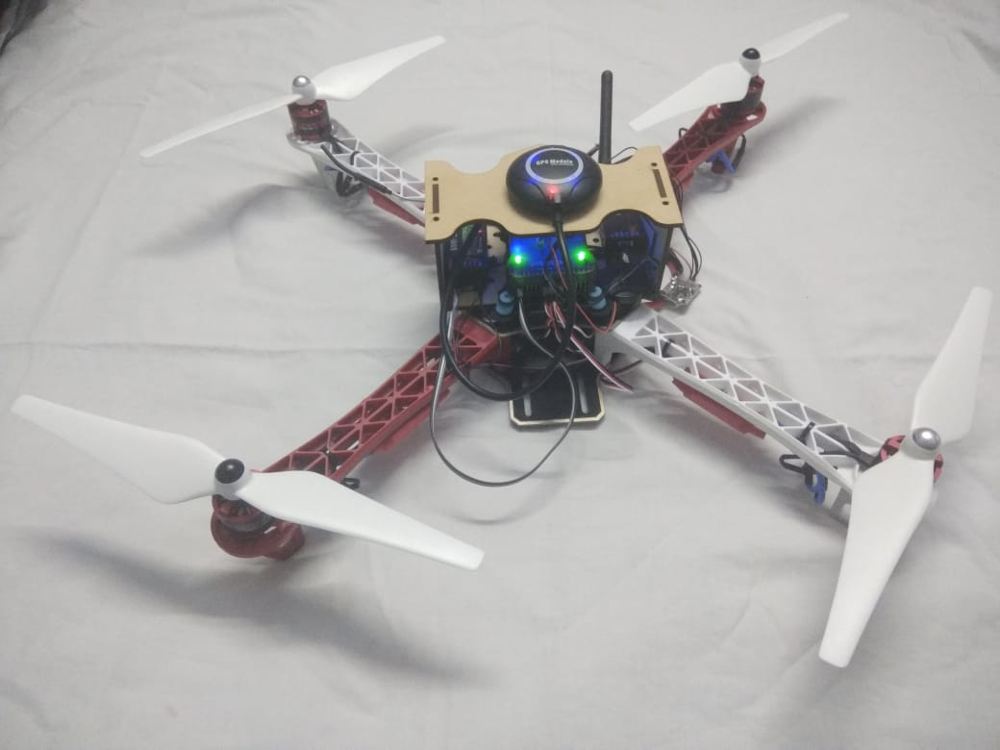
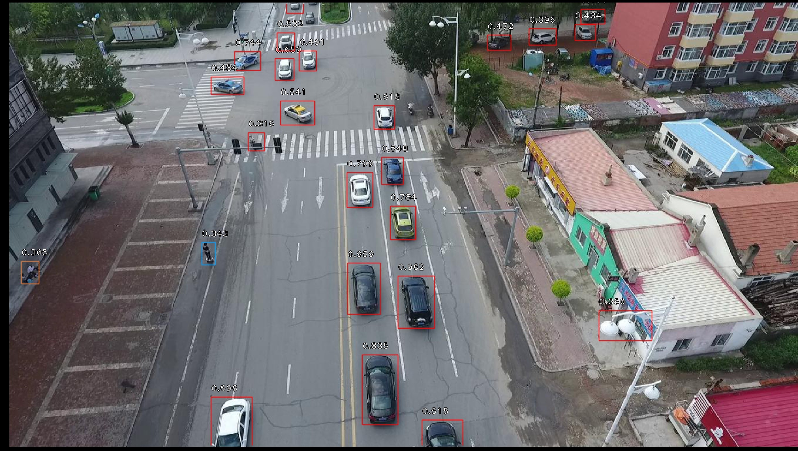

# Real-time object detection with UAVs

## Retina-net model on remote server
### 1)	Pre-processing the dataset
The image dataset and corresponding annotations of [Aiskyeye aerial image data](http://aiskyeye.com/) has to be brought into an appropriate format for the RetinaNet library. The preprocessing_dataset.py script has 3 functions to do so:

1. Preprocessing_images: The function will take 40 random images from selected scenario in the aiskyeye – training, validation, testing - dataset, rename them and copy the images to new folder. New naming format is <scenario_name>+<image_id>+”.jpg”. These selected scenarios in the dataset will have to be selected manually according to view during the real-time testing.

1.	Preprocessing_annotations: The function will use the annotations in the aiskyeye dataset and modify it to create annotations csv files of all the images in aiskyeye dataset – training, validation, testing – and the entry of csv files will be in the following format:
`path/to/image.jpg,x1,y1,x2,y2,class_name`  
Bounding box: (x1, y1) to (x2, y2)  
A full example:  
`/data/imgs/img_001.jpg,837,346,981,456,cow
/data/imgs/img_002.jpg,215,312,279,391,cat
/data/imgs/img_002.jpg,22,5,89,84,bird
/data/imgs/img_003.jpg,,,,,`  
This defines a dataset with 3 images. img_001.jpg contains a cow. img_002.jpg contains a cat and a bird. img_003.jpg contains no interesting objects/animals.

1.	filter_csv: The function will filter the the entries in csv file created by preprocessing_annotations function, according to the images selected by preprocessing_images function and put them in “annotations/” directory in the training and validation datasets. 
Note: Execute the functions in above-mentioned order
Also, A class mapping csv file has to be created that maintains class id again each classes name, as mentioned in keras-retinanet library [[1]](https://github.com/fizyr/keras-retinanet).  
`class_name,id`

The annotations in new dataset can be validated with testing_annotaions.py. The script will create the bounding box for the images in dataset which can be verified manually.

### 2) Training the Network
The CNN can be trained on the new dataset created with train.ipynb jupyter notebook. Parameters such as batch-size, image-size, image-augmentation, number of epochs can be modified in the script.\
The “resnet50_coco_best_v2.1.0.h5” pretrained model was used for backbone of the network. Initially weights of backbone were frozen i.e. not trained and after improvement in the model backbone weights were also trained to improve the efficiency of the model.
### 3) Get prediction and Visualise
The trained model are saved in “saved/” directory with each epoch number.\
First run, prediction.ipynb which will convert training model into inference model. The inference model will then run on batches of testing images and then save the predictions in “prediction/” directory for each image in .txt format.
Then, visualize.ipynb will visualize the predictions on the testing images. The model has to be converted into inference model.

## Interface Raspberry Pi with a remote server

1.	**Setup the Raspberry pi** \
*Note:* Raspberry Pi needs monitor the boot the operating systems for the first time. If monitor is not available then the raspberry pi can be set up headless as following:\
*i)	Enable SSH* \
In some Linux distributions SSH is enabled by default. In the Raspbian version used for this project (Raspbian Jessie) SSH was disabled by default. After cloning the Raspbian image to a SD card, there are two partitions (one called boot and one named with a random pattern like 62ca0b6d-6291-4c40-b1fd-11bc291e4a38. To enable SSH, simply create an empty file named ssh on the boot partition. When booting, the green ACT LED needs to blink in a random fashion. This LED shows that the Raspberry Pi is able to read from the SD card.\
*ii)	Get the IP of Raspberry Pi* \
use ‘ifconfig’ if in ssh or using raspberry pi with a display. If using in headless mode, tools such as advanced ip-scanner can be used to get the list of IPs against the name of devices connected to the network. 
Note: The IP address if connected in hostels to BITS LAN will be in 172.17.2x.xx and if to BITS Wi-Fi then 172.17.7x.xxx (example: for me, it was 172.17.26.xx and 172.17.77.xx) \
*iii)	Accessing the Raspberry Pi via SSH in the Terminal* \
The Ethernet interface of the Raspberry Pi is enabled by default. So either you connect the Raspberry Pi to a router (or a switch) or you connect it directly to your computer and configure your computer's Ethernet interface as "shared to other computers" (this is an option of the network manager in Debian/Ubuntu). Then you need to get to now the IP address of the Raspberry Pi. Under Linux this can be done by using the tool nmap with the following command:\
`nmap -sn <IP>/<SUBNETMASK> `\
where <IP> is the IP address of the network and <SUBNETMASK> the mask for the subnetwork.
1. **Enable ssh and vnc** \
Use ‘sudo raspi-config’ to enable ssh and vnc of raspberry pi . Install vnc viewer in the remote computer. The screen of raspberry pi will be replicated in the viewer, this makes accessing easier.
1. **Enable picamera** \
Plugin the camera into raspberrypi and use the command ‘vcgencmd get_camera’ to check the connection. The command should return ‘supported = 1, detected = 1’ in case of proper connection.
1. **Connect to server** \
Run interface_camera.py to capture the photos in real-time and send it to remote server which executes the object-detection model.\
interface_camera.py has two threads running, one for capturing and storing image and other is for transmitting the stored image to the server. It uses paramiko library for easier scp to the server.

## Screenshots

## References

[1] 
“Keras-Retinanet Github,” [Online]. Available: https://github.com/fizyr/keras-retinanet.
